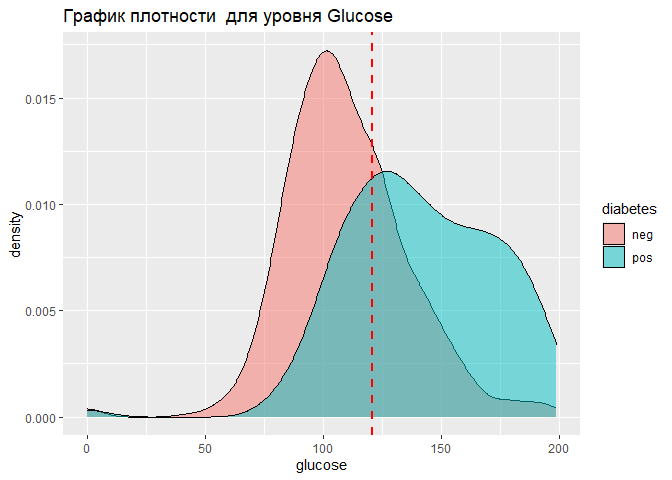
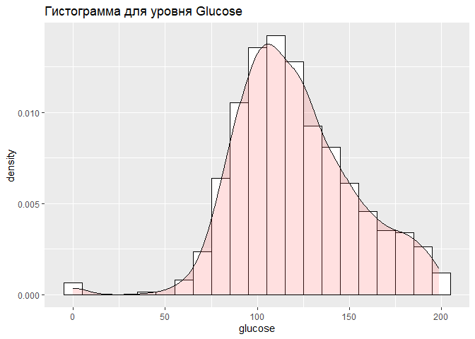
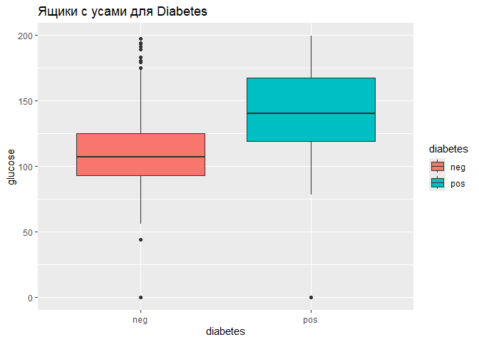
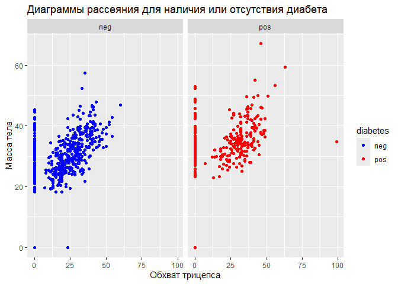

ДЗ 3. Расчет описательных статистик (Сметанина Д.Я.)
================
2024-03-24

## Тема: расчет описательных статистик.

**Цель**: научиться считать описательные статистики для количественной и
категориальной переменных, строить доверительный интервал, а также
графики плотности вероятности.

В первых двух заданиях вам необходимо посчитать описательные статистики.
Для количественной переменной рассчитайте число наблюдений, среднее,
стандартное отклонение, 1-й и 3-й квартили, минимум и максимум. Для
категориальной переменной определите абсолютную и относительные частоты.

## Необходимо выполнить следующие пункты:

- Рассчитайте описательные статистики для переменных glucose, pressure,
  mass. — 1 балл

- Рассчитайте описательную статистику для переменной diabetes. - - -
  Создайте на основе переменной age новую переменную age_group, которая
  будет отражать следующие возрастные группы: 21–35, 36–49 и 50+.
  Посчитайте описательную статистику для новой переменной. — 1 балл

- Определите 90% доверительный интервал для переменной pedigree. — 2
  балла

- Постройте график плотности вероятности для переменной glucose и
  отметьте на нем среднее значение. Для той же переменной постройте
  гистограмму. Постройте два ящика с усами для значений pos и neg
  соответственно переменной diabetes. — 3 балла

- Постройте на одном графике две диаграммы рассеяния для наличия или
  отсутствия диабета. По оси X представьте значения обхвата трицепса, а
  по оси Y — массу тела. Выполните окрашивание, заливку и группирование
  по переменной diabetes. — 3 балла

``` r
#install.packages("tidyverse")
#install.packages("readxl")
# загрузка библиотек
library(tidyverse)
```

    ## ── Attaching core tidyverse packages ──────────────────────── tidyverse 2.0.0 ──
    ## ✔ dplyr     1.1.4     ✔ readr     2.1.5
    ## ✔ forcats   1.0.0     ✔ stringr   1.5.1
    ## ✔ ggplot2   3.5.0     ✔ tibble    3.2.1
    ## ✔ lubridate 1.9.3     ✔ tidyr     1.3.1
    ## ✔ purrr     1.0.2     
    ## ── Conflicts ────────────────────────────────────────── tidyverse_conflicts() ──
    ## ✖ dplyr::filter() masks stats::filter()
    ## ✖ dplyr::lag()    masks stats::lag()
    ## ℹ Use the conflicted package (<http://conflicted.r-lib.org/>) to force all conflicts to become errors

``` r
library(readxl)
```

``` r
# Чтение данных из файла Excel
data <- read_excel("c:/dataset/pima.xlsx")
```

``` r
# Вывод первых нескольких строк датафрейма
head(data)
```

    ## # A tibble: 6 × 9
    ##   pregnant glucose pressure triceps insulin  mass pedigree   age diabetes
    ##      <dbl>   <dbl>    <dbl>   <dbl>   <dbl> <dbl>    <dbl> <dbl> <chr>   
    ## 1        6     148       72      35       0  33.6    0.627    50 pos     
    ## 2        1      85       66      29       0  26.6    0.351    31 neg     
    ## 3        8     183       64       0       0  23.3    0.672    32 pos     
    ## 4        1      89       66      23      94  28.1    0.167    21 neg     
    ## 5        0     137       40      35     168  43.1    2.29     33 pos     
    ## 6        5     116       74       0       0  25.6    0.201    30 neg

Файл вероятно содержит следующие столбцы:

- pregnant: количество беременностей.

- glucose: уровень глюкозы в плазме.

- pressure: диастолическое артериальное давление (мм рт. ст.).

- triceps: толщина кожной складки трицепса (мм).

- insulin: двухчасовой уровень сывороточного инсулина (мкЕд/мл).

- mass: индекс массы тела.

- pedigree: диабетическая родословная функция.

- age: возраст (лет).

- diabetes: диагноз “диабет” (позитивный - ‘pos’, негативный - ‘neg’).

В первых двух заданиях вам необходимо посчитать описательные статистики.
Для количественной переменной рассчитайте число наблюдений, среднее,
стандартное отклонение, 1-й и 3-й квартили, минимум и максимум. Для
категориальной переменной определите абсолютную и относительные частоты.

### Необходимо выполнить следующие пункты:

1.  Рассчитайте описательные статистики для переменных glucose,
    pressure, mass. — 1 балл

2.  Рассчитайте описательную статистику для переменной diabetes.
    Создайте на основе переменной age новую переменную age_group,
    которая будет отражать следующие возрастные группы: 21–35, 36–49 и
    50+. Посчитайте описательную статистику для новой переменной. — 1
    балл

3.  Определите 90% доверительный интервал для переменной pedigree. — 2
    балла

4.  Постройте график плотности вероятности для переменной glucose и
    отметьте на нем среднее значение. Для той же переменной постройте
    гистограмму. Постройте два ящика с усами для значений pos и neg
    соответственно переменной diabetes. — 3 балла

5.  Постройте на одном графике две диаграммы рассеяния для наличия или
    отсутствия диабета. По оси X представьте значения обхвата трицепса,
    а по оси Y — массу тела. Выполните окрашивание, заливку и
    группирование по переменной diabetes. — 3 балла

6.  **Описательные статистики для переменных glucose, pressure, mass**

    ``` r
    # Описательные статистики для количественных переменных
    summary(data$glucose)
    ```

        ##    Min. 1st Qu.  Median    Mean 3rd Qu.    Max. 
        ##     0.0    99.0   117.0   120.9   140.2   199.0

    ``` r
    summary(data$pressure)
    ```

        ##    Min. 1st Qu.  Median    Mean 3rd Qu.    Max. 
        ##    0.00   62.00   72.00   69.11   80.00  122.00

    ``` r
    summary(data$mass)
    ```

        ##    Min. 1st Qu.  Median    Mean 3rd Qu.    Max. 
        ##    0.00   27.30   32.00   31.99   36.60   67.10

или с использованием функции summarise()

``` r
data %>%
  summarise( # Используем функцию summarise() из пакета dplyr для расчета статистик.
    Mean_Glucose = mean(glucose, na.rm = TRUE), # mean() используем для расчета среднего значения.
    SD_Glucose = sd(glucose, na.rm = TRUE), # sd() используем для расчета стандартного отклонения.
    Q1_Glucose = quantile(glucose, 0.25, na.rm = TRUE), # quantile() с параметром 0.25 вычисляет первый квартиль.
    Q3_Glucose = quantile(glucose, 0.75, na.rm = TRUE), # quantile() с параметраом 0.75 вычисляет третий квартиль.
    Min_Glucose = min(glucose, na.rm = TRUE),  # min() используем для расчета  минимального значения.
    Max_Glucose = max(glucose, na.rm = TRUE),  # max() используем для расчета  максимального значения.
   Mean_Pressure = mean(pressure, na.rm = TRUE), # mean() используем для расчета среднего значения.
    SD_Pressure = sd(pressure, na.rm = TRUE), # sd() используем для расчета стандартного отклонения.
    Q1_Pressure = quantile(pressure, 0.25, na.rm = TRUE), # quantile() с параметром 0.25 вычисляет первый квартиль.
    Q3_Pressure = quantile(pressure, 0.75, na.rm = TRUE), # quantile() с параметраом 0.75 вычисляет третий квартиль.
    Min_Pressure = min(pressure, na.rm = TRUE), # min() используем для расчета  минимального значения.
    Max_Pressure = max(pressure, na.rm = TRUE), # max() используем для расчета  максимального значения.
    Mean_Mass = mean(mass, na.rm = TRUE), # mean() используем для расчета среднего значения.
    SD_Mass = sd(mass, na.rm = TRUE), # sd() используем для расчета стандартного отклонения.
    Q1_Mass = quantile(mass, 0.25, na.rm = TRUE), # quantile() с параметром 0.25 вычисляет первый квартиль.
    Q3_Mass = quantile(mass, 0.75, na.rm = TRUE), # quantile() с параметраом 0.75 вычисляет третий квартиль.
    Min_Mass = min(mass, na.rm = TRUE), # min() используем для расчета  минимального значения.
    Max_Mass = max(mass, na.rm = TRUE) # max() используем для расчета  максимального значения.
  )
```

    ## # A tibble: 1 × 18
    ##   Mean_Glucose SD_Glucose Q1_Glucose Q3_Glucose Min_Glucose Max_Glucose
    ##          <dbl>      <dbl>      <dbl>      <dbl>       <dbl>       <dbl>
    ## 1         121.       32.0         99       140.           0         199
    ## # ℹ 12 more variables: Mean_Pressure <dbl>, SD_Pressure <dbl>,
    ## #   Q1_Pressure <dbl>, Q3_Pressure <dbl>, Min_Pressure <dbl>,
    ## #   Max_Pressure <dbl>, Mean_Mass <dbl>, SD_Mass <dbl>, Q1_Mass <dbl>,
    ## #   Q3_Mass <dbl>, Min_Mass <dbl>, Max_Mass <dbl>

Эти результаты представляют описательные статистики для трех переменных:
glucose (глюкоза), pressure (давление) и mass (масса тела):

а) Глюкоза (glucose):

- Минимум (Min.): Самый низкий уровень глюкозы в выборке равен 0. Это
  может указывать на наличие ошибок или пропущенных значений, так как
  реальный уровень глюкозы не может быть нулевым.

- Первый квартиль (1st Qu.): 25% людей в выборке имеют уровень глюкозы
  ниже 99.

- Медиана (Median): Половина людей в выборке имеет уровень глюкозы ниже
  или равно 117.

- Среднее (Mean): Средний уровень глюкозы в выборке составляет 120.9.
  Сравнение среднего с медианой может указывать на асимметрию
  распределения.

- Третий квартиль (3rd Qu.): 75% людей имеют уровень глюкозы ниже 140.2.

- Максимум (Max.): Максимальный уровень глюкозы в выборке равен 199.

б) Артериальное давление (pressure):

- Минимум (Min.): Наименьшее значение артериального давления равно 0,
  что, как и в случае с глюкозой, вероятно указывает на ошибку или
  пропущенные значения.

- Первый квартиль (1st Qu.): 25% измерений давления находятся ниже 62 мм
  рт. ст.

- Медиана (Median): Медианное значение давления равно 72 мм рт. ст.

- Среднее (Mean): Среднее значение давления равно 69.11 мм рт. ст. В
  данном случае, среднее меньше медианы, что может указывать на
  левостороннюю асимметрию распределения.

- Третий квартиль (3rd Qu.): 75% измерений давления менее 80 мм рт. ст.

- Максимум (Max.): Максимальное значение давления равно 122 мм рт. ст.

в) Масса тела (mass):

- Минимум (Min.): Минимальная масса тела в выборке равна 0, что, скорее
  всего, также является ошибкой или пропущенным значением.

- Первый квартиль (1st Qu.): 25% измерений массы тела меньше или равны
  27.3.

- Медиана (Median): Половина выборки имеет массу тела менее или равную
  32.

- Среднее (Mean): Средняя масса тела равна 31.99, что близко к медиане,
  указывая на более симметричное распределение по сравнению с другими
  переменными.

- Третий квартиль (3rd Qu.): 75% измерений массы тела находятся ниже
  36.6.

- Максимум (Max.): Максимальная масса тела равна 67.1.

2.  **Описательные статистики для переменной diabetes и создание
    переменной**

``` r
# Преобразуем переменную `diabetes` из character в factor:
data <- data %>%
  mutate(diabetes = as.factor(diabetes))
```

``` r
# Описательная статистика для категориальной переменной
table(data$diabetes)
```

    ## 
    ## neg pos 
    ## 500 268

``` r
prop.table(table(data$diabetes))
```

    ## 
    ##       neg       pos 
    ## 0.6510417 0.3489583

``` r
# Создание новой переменной age_group
data$age_group <- cut(data$age, breaks = c(21, 35, 49, Inf), right = FALSE, labels = c("21–35", "36–49", "50+"))
table(data$age_group)
```

    ## 
    ## 21–35 36–49   50+ 
    ##   488   186    94

``` r
prop.table(table(data$age_group))
```

    ## 
    ##     21–35     36–49       50+ 
    ## 0.6354167 0.2421875 0.1223958

Эти результаты предоставляют описательные статистики для категориальных
переменных diabetes и age_group:

а) Диабет (diabetes):

- neg (отрицательный): 500 наблюдений не имеют диабета.

- pos (положительный): 268 наблюдений имеют диабет.

Относительные частоты: 65.1% наблюдений отрицательны (не имеют диабета),
а 34.9% положительны (имеют диабет).

б) Возрастная группа (age_group):

- 21–35 лет: 488 человек попадают в эту возрастную группу.

- 36–49 лет: 186 человек попадают в эту возрастную группу.

- 50 лет и старше: 94 человека попадают в эту возрастную группу.

Относительные частоты: 63.54% населения находятся в возрастной группе
21–35 лет, 24.22% в возрастной группе 36–49 лет и 12.24% в возрастной
группе 50 лет и старше.

3.  **age_group90% доверительный интервал для переменной pedigree**

``` r
# 90% доверительный интервал для pedigree
t.test(data$pedigree, conf.level = 0.90)$conf.int
```

    ## [1] 0.4521870 0.4915656
    ## attr(,"conf.level")
    ## [1] 0.9

Доверительный интервал указывает на диапазон, в котором, с определенной
степенью уверенности (в данном случае 90%), находится истинное среднее
значение популяции для изучаемой переменной.

Результаты:

- Нижняя граница интервала: 0.4522

- Верхняя граница интервала: 0.4916

Это означает, что с 90% уверенностью мы можем сказать, что истинное
среднее значение диабетической родословной функции в выборке находится
между 0.4522 и 0.4916.

4.  **Графики для переменной glucose и ящики с усами для переменной
    diabetes**

``` r
# График плотности вероятности для glucose
ggplot(data, aes(x = glucose)) +
    geom_density(aes(fill = diabetes), alpha = 0.5) +
    geom_vline(aes(xintercept=mean(glucose, na.rm = TRUE)), color="red", linetype="dashed", size=1) +
    ggtitle("График плотности  для уровня Glucose")
```

    ## Warning: Using `size` aesthetic for lines was deprecated in ggplot2 3.4.0.
    ## ℹ Please use `linewidth` instead.
    ## This warning is displayed once every 8 hours.
    ## Call `lifecycle::last_lifecycle_warnings()` to see where this warning was
    ## generated.

<!-- -->

``` r
# Гистограмма для glucose
ggplot(data, aes(x = glucose)) +
    geom_histogram(aes(y = ..density..),binwidth = 10, color = "black", fill = "white") +
    geom_density(alpha = 0.2, fill = "#FF6666") +
    ggtitle("Гистограмма для уровня Glucose")
```

    ## Warning: The dot-dot notation (`..density..`) was deprecated in ggplot2 3.4.0.
    ## ℹ Please use `after_stat(density)` instead.
    ## This warning is displayed once every 8 hours.
    ## Call `lifecycle::last_lifecycle_warnings()` to see where this warning was
    ## generated.

<!-- -->

``` r
# Ящики с усами для diabetes
ggplot(data, aes(x = diabetes, y = glucose, fill = diabetes)) +
    geom_boxplot() +
    ggtitle("Ящики с усами для Diabetes")
```

<!-- -->

а) График плотности для переменной glucose (уровень глюкозы в крови). На
этом графике:

- По горизонтальной оси (ось X) отображается уровень глюкозы.

- По вертикальной оси (ось Y) отображается плотность – это не абсолютные
  значения, а относительные, показывающие, как часто встречаются
  различные значения глюкозы.

- Кривая показывает распределение уровней глюкозы среди наблюдений в
  наборе данных.

- Красная пунктирная линия указывает на среднее значение уровня глюкозы
  в выборке.

б) Гистограмма для переменной glucose (уровень глюкозы в крови) вместе с
наложенной кривой плотности.

На гистограмме:

- По горизонтальной оси (ось X) отображается уровень глюкозы.

- По вертикальной оси (ось Y) отображается плотность, т.е. относительная
  частота наблюдений в каждом интервале глюкозы.

- Колонки (бины) гистограммы показывают, сколько наблюдений попадают в
  каждый диапазон уровней глюкозы.

- Наложенная кривая плотности показывает непрерывное распределение
  уровней глюкозы, представляя, как данные могли бы выглядеть, если бы
  мы смогли измерить их на непрерывной шкале.

График позволяет визуально оценить распределение уровня глюкозы среди
изучаемой выборки. В данном случае, кажется, что распределение
приближается к нормальному, но с положительной асимметрией, так как
хвост распределения тяготеет к более высоким значениям глюкозы. Наличие
значений близких к нулю может также указывать на наличие некорректных
данных или пропусков.

Гистограмма помогает увидеть частотность различных значений глюкозы в
выборке и сравнить их с тем, что можно было бы ожидать в случае
нормального распределения (как показывает гладкая кривая).

в) Ящики с усами (box plots), отображают распределение уровней глюкозы
для двух групп людей: тех, кто не страдает диабетом (обозначено как
‘neg’), и тех, кто страдает диабетом (обозначено как ‘pos’).

На графике:

- Ящик (Box): Представляет собой диапазон значений от первого квартиля
  (Q1, нижний край ящика) до третьего квартиля (Q3, верхний край ящика).
  Это называется межквартильным размахом (IQR) и охватывает средние 50%
  данных для каждой группы. Линия внутри ящика обозначает медиану
  (второй квартиль, Q2).

- Усы (Whiskers): Линии, выходящие из ящика вверх и вниз, показывают
  вариабельность вне квартилей. Они обычно простираются до последней
  точки в пределах 1.5 IQR от ящика. Точки за пределами усов считаются
  выбросами, которые могут указывать на аномальные значения.

Из графика видно:

- У людей с диабетом (‘pos’) медиана уровня глюкозы выше, чем у людей
  без диабета (‘neg’). Это ожидаемо, так как высокий уровень глюкозы
  является одним из признаков диабета.

- Распределение уровня глюкозы среди людей с диабетом шире (ящик выше),
  что указывает на большую вариабельность значений по сравнению с
  группой без диабета.

- Обе группы имеют выбросы, что указывает на наличие значений глюкозы,
  которые сильно отличаются от большинства наблюдений в каждой группе.
  Особенно много выбросов у группы без диабета, что может указывать на
  наличие подгрупп внутри этой категории или на ошибки измерения.

В целом, этот график иллюстрирует, как диабет связан с более высокими
уровнями глюкозы и какие различия существуют в распределении уровней
глюкозы между людьми с диабетом и без него.

5.  **Диаграммы рассеяния для переменной diabetes с обхватом трицепса и
    массой тела**

``` r
# Диаграммы рассеяния для diabetes с использованием facet_grid()
ggplot(data, aes(x = triceps, y = mass)) +
    geom_point(aes(color = diabetes)) +
    facet_grid(. ~ diabetes) +
    scale_color_manual(values = c("pos" = "red", "neg" = "blue")) +
    ggtitle("Диаграммы рассеяния для наличия или отсутствия диабета") +
    xlab("Обхват трицепса") +
    ylab("Масса тела")
```

<!-- -->

Две диаграммы рассеяния, разделенные с помощью функции facet_grid() на
две панели по переменной diabetes: одна для людей без диабета (‘neg’,
слева) и одна для людей с диабетом (‘pos’, справа). Он показывает
взаимосвязь между обхватом трицепса (по оси X) и массой тела (по оси Y)
для обеих групп.

Основные наблюдения, которые можно сделать из этого графика:

- Разделение по диабету: График четко разделяет людей на две группы (с
  диабетом и без), позволяя сравнить распределение обхвата трицепса и
  массы тела в этих двух группах.

- Общая тенденция: В обеих группах видна тенденция увеличения массы тела
  с увеличением обхвата трицепса, хотя это может быть более выражено у
  людей без диабета.

- Распределение значений: Люди с диабетом (‘pos’) в среднем имеют
  большую массу тела по сравнению с людьми без диабета (‘neg’), что
  видно из расположения точек на соответствующих панелях.

- Выбросы и аномалии: В обеих группах присутствуют выбросы, например,
  люди с очень маленьким обхватом трицепса и большой массой тела или
  наоборот. Эти точки могут представлять аномальные случаи или ошибки
  измерения.

- Различие между группами: Похоже, что в группе людей с диабетом (‘pos’)
  больше разнообразие как по обхвату трицепса, так и по массе тела по
  сравнению с группой без диабета (‘neg’).
