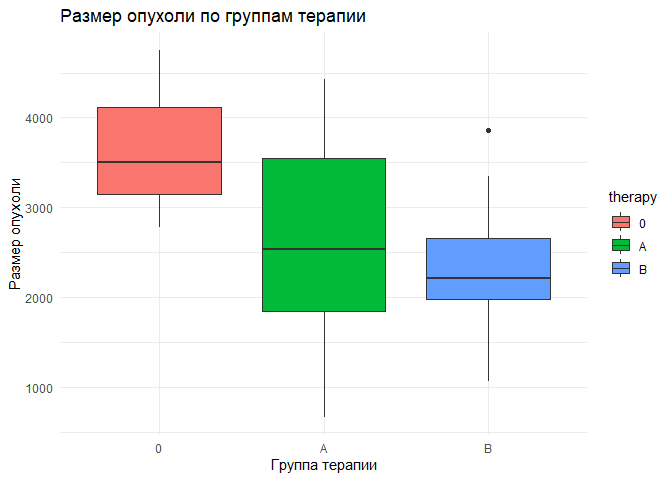

DZ4_SmetaninaDY
================
2024-04-02

# **Домашнее задание 4**

**Тема**: использование основных статистических тестов и поправок на
множественные сравнения.

**Цель**: разберем использование основных параметрических и
непараметрических статистических тестов, научимся вводить поправки на
множественные сравнения и поймем, чем они отличаются.

## Задание 1 (2 балла) Рассмотрите следующую статистическую гипотезу.

Проводят некоторое исследование пациентов с артериальной гипертензией.
Предположим, что внедрение нового препарата в среднем лучше снижает их
давление по сравнению со стандартной терапией.

Задайте seed для воспроизводимости результатов (функция set.seed()).
Задайте размер выборки sample_size \<- 30. Задайте значение среднего
артериального давления до приема нового препарата и после.

Затем:

Сформулируйте нулевую и альтернативную гипотезы. Определите уровень
значимости. Выберите статистический тест для проверки гипотезы и
аргументируйте свой выбор. Определите наблюдаемое значение статистики, а
также критическое значение статистики. Оцените и прокомментируйте
статистическую значимость. Формулировка гипотез

Нулевая гипотеза (H0): Новый препарат не отличается по эффективности в
снижении артериального давления от стандартной терапии. Это означает,
что разница в средних артериальных давлениях до и после приема нового
препарата равна 0. Альтернативная гипотеза (H1): Новый препарат более
эффективен в снижении артериального давления по сравнению со стандартной
терапией, т.е. среднее артериальное давление после приема нового
препарата ниже. Уровень значимости

Уровень значимости (α) — это порог, по которому мы решаем, достаточно ли
сильно наши данные противоречат нулевой гипотезе. Чаще всего используют
α=0.05, что означает 5% риск ошибки первого рода (отвергнуть нулевую
гипотезу, когда она верна).

``` r
# Устанавливаем seed для воспроизводимости результатов
set.seed(40)

# Задаем размер выборки
sample_size <- 30

# Задаем среднее артериальное давление до и стандартное отклонение
mean_before <- 140  # предполагаемое среднее значение артериального давления до
std_dev <- 10  # стандартное отклонение

# Генерируем выборку давления до приема нового препарата
pressure_before <- rnorm(sample_size, mean_before, std_dev)

# Предполагаем, что препарат снижает давление в среднем на 5 единиц со стандартным отклонением 5
effect <- -5  # среднее снижение давления
effect_std_dev <- 5  # стандартное отклонение эффекта

# Генерируем эффект от нового препарата и создаем выборку после приема препарата
effect_samples <- rnorm(sample_size, effect, effect_std_dev)
pressure_after <- pressure_before + effect_samples
```

Перед проведением парного t-теста проверим выборки на нормальность
распределения, поскольку t-тест предполагает, что разности между парами
наблюдений распределены нормально. Это поможет убедиться, что
использование параметрических методов, таких как t-тест, является
обоснованным.

``` r
# Вычисляем разности между парами наблюдений
differences <- pressure_after - pressure_before

# Проверка на нормальность с помощью теста Шапиро-Уилка
shapiro_test <- shapiro.test(differences)

# Выводим результаты теста Шапиро-Уилка
print(shapiro_test)
```

    ## 
    ##  Shapiro-Wilk normality test
    ## 
    ## data:  differences
    ## W = 0.97813, p-value = 0.774

Результат теста Шапиро-Уилка с p-значением 0.774 указывает на то, что
нет оснований отвергать нулевую гипотезу о нормальности распределения
разностей между значениями артериального давления до и после приема
препарата. Статистика W равна 0.97813, что также свидетельствует о том,
что распределение разностей близко к нормальному.

Таким образом, использование парного t-теста в данном случае является
обоснованным, поскольку одно из основных предположений этого теста —
нормальность распределения разностей между парами наблюдений —
подтверждается.

``` r
# Выполняем t-тест для зависимых выборок
t_test_result <- t.test(pressure_before, pressure_after, paired = TRUE)

# Выводим результаты t-теста
print(t_test_result)
```

    ## 
    ##  Paired t-test
    ## 
    ## data:  pressure_before and pressure_after
    ## t = 3.2982, df = 29, p-value = 0.002579
    ## alternative hypothesis: true mean difference is not equal to 0
    ## 95 percent confidence interval:
    ##  1.129155 4.815343
    ## sample estimates:
    ## mean difference 
    ##        2.972249

Полученные результаты парного t-теста указывают на следующее:

- t-статистика:

Значение t-статистики составляет 3.2982. Это значение показывает,
насколько далеко (в стандартных отклонениях) наблюдаемое среднее
различие отклоняется от нуля (или другого значения, указанного в нулевой
гипотезе, если бы такое было). Степени свободы (df): Степени свободы для
этого теста составляют 29, что соответствует размеру выборки минус один
(30 - 1 = 29).

- p-значение:

p-значение равно 0.002579, что значительно меньше стандартного порога
значимости 0.05. Это указывает на то, что различие между средними
значениями давления до и после приема препарата статистически значимо.

- Альтернативная гипотеза:

Гипотеза теста заключается в том, что истинное среднее различие не равно
нулю, что подтверждается результатами.

- 95% доверительный интервал для разности средних:

Доверительный интервал составляет от 1.129155 до 4.815343. Это означает,
что с 95% вероятностью истинное среднее различие давлений до и после
лежит в этом интервале. Доверительный интервал не включает ноль, что
также указывает на статистическую значимость различий.

- Оценка среднего различия:

Среднее различие между давлениями до и после составляет 2.972249
единицы. Это означает, что в среднем давление снижается на эту величину
после приема препарата.

Выводы

На основании полученных результатов можно сделать вывод, что новый
препарат статистически значимо снижает артериальное давление у пациентов
с артериальной гипертензией по сравнению со стандартной терапией. Это
подтверждает альтернативную гипотезу и позволяет отвергнуть нулевую
гипотезу о том, что препарат не оказывает значимого эффекта на снижение
артериального давления.

### Задание 2 (2 балла)

Рассмотрите следующую статистическую гипотезу.

Существует некоторая связь между курением и развитием рака легких. Пусть
у курящих людей вероятность заболеть раком легких составляет 0.8, а у
некурящих — 0.2

Рассмотрите два случая: для выборки sample_size1 \<- 100 и выборки
sample_size2 \<- 30. Сгенерируйте данные по курению с помощью функции
rep(), пусть отношение числа курящих к некурящим в каждой выборке
составляет 1:1.

Затем:

- Сформулируйте нулевую и альтернативную гипотезы.

- Определите уровень значимости.

- Выберите статистический тест для проверки гипотезы и аргументируйте
  свой выбор.

- Определите наблюдаемое значение статистики, а также критическое
  значение статистики.

- Оцените и прокомментируйте статистическую значимость.

1.  Формулировка гипотез

- Нулевая гипотеза (H0): Нет различия в вероятности развития рака легких
  между курящими и некурящими людьми. То есть различия, если они
  наблюдаются, случайны и не имеют статистической значимости.

- Альтернативная гипотеза (H1): Существует статистически значимое
  различие в вероятности развития рака легких между курящими и
  некурящими.

2.  Уровень значимости

Выберем уровень значимости α=0.05, который является стандартным выбором
для большинства статистических тестов. Это означает, что мы готовы
принять до 5% риск ошибочно отвергнуть нулевую гипотезу, когда она на
самом деле верна.

3.  Выбор статистического теста

Для анализа связи между курением и развитием рака легких мы можем
использовать тест Хи-квадрат для независимых выборок. Этот выбор
обусловлен категориальной природой данных (курение / не курение) и
интересом к сравнению частот в двух группах. Тест Хи-квадрат позволяет
определить, есть ли статистически значимая разница между ожидаемыми и
наблюдаемыми частотами случаев рака легких среди курящих и некурящих.

Тест Хи-квадрат проверяет нулевую гипотезу о том, что нет никакой
ассоциации (связи) между двумя категориальными переменными (в вашем
случае, курение и развитие рака легких). Для этого он сравнивает
наблюдаемые частоты случаев в каждой категории с частотами, которые
ожидались бы, если бы между переменными не было никакой связи.

Важные моменты, которые следует учитывать при проведении теста
Хи-квадрат:

- Минимальное количество наблюдений:

Рекомендуется, чтобы в каждой ячейке таблицы сопряженности было не менее
5 наблюдений. Если в некоторых ячейках меньше 5 наблюдений, может
потребоваться использование точного теста Фишера.

- Независимость наблюдений:

Тест предполагает, что каждое наблюдение независимо от других, и каждый
случай можно отнести только к одной ячейке таблицы.

``` r
# Установим seed для воспроизводимости результатов
set.seed(42)

# Задаем размеры выборок
sample_size1 <- 100
sample_size2 <- 30

# Генерируем данные
# Для выборки размером 100
smokers1 <- rep(c(1, 0), each = sample_size1 / 2)
cancer1 <- c(rbinom(sample_size1 / 2, 1, 0.8), rbinom(sample_size1 / 2, 1, 0.2))

# Для выборки размером 30
smokers2 <- rep(c(1, 0), each = sample_size2 / 2)
cancer2 <- c(rbinom(sample_size2 / 2, 1, 0.8), rbinom(sample_size2 / 2, 1, 0.2))

# Проведем тест Хи-квадрат для первой выборки
table1 <- table(smokers1, cancer1)
chisq.test(table1)
```

    ## 
    ##  Pearson's Chi-squared test with Yates' continuity correction
    ## 
    ## data:  table1
    ## X-squared = 29, df = 1, p-value = 7.236e-08

``` r
# Проведем тест Хи-квадрат для второй выборки
table2 <- table(smokers2, cancer2)
chisq.test(table2)
```

    ## 
    ##  Pearson's Chi-squared test with Yates' continuity correction
    ## 
    ## data:  table2
    ## X-squared = 8.5333, df = 1, p-value = 0.003487

``` r
# Уровень значимости 0.05 и одна степень свободы
critical_value <- qchisq(0.95, df = 1)
print(critical_value)
```

    ## [1] 3.841459

4.  Определение наблюдаемого и критического значений статистики

Наблюдаемое значение статистики (X-squared)

Это значение, которое вычисляется в ходе статистического теста и
отражает меру расхождения между наблюдаемыми и ожидаемыми частотами в
категориальных данных. Для ваших тестов наблюдаемые значения статистики
равны:

- Для выборки размером 100: 29

- Для выборки размером 30: 8.5333

Критическое значение статистики

Критическое значение статистики - это пороговое значение, которое
используется для определения, следует ли отвергать нулевую гипотезу на
основе наблюдаемого значения статистики. Критическое значение зависит от
выбранного уровня значимости (α) и степеней свободы (df) теста.

Для теста Хи-квадрат с одной степенью свободы (как в нашем случае, где
сравниваются две группы) и уровнем значимости α=0.05 критическое
значение составляет около 3.841.

Оценка статистической значимости

Сравнивая наблюдаемое значение статистики с критическим, можно сделать
вывод о статистической значимости:

Для обеих выборок наблюдаемое значение значительно превышает критическое
значение 3.841, что указывает на статистически значимую связь между
курением и развитием рака легких. Это означает, что нулевая гипотеза о
том, что нет различия в вероятности развития рака легких между курящими
и некурящими, может быть отвергнута. Таким образом, результаты обоих
тестов подтверждают наличие статистически значимой ассоциации между
курением и увеличенной вероятностью развития рака легких, что
согласуется с общепризнанными научными данными о вреде курения.

5.  Оцените и прокомментируйте статистическую значимость.

Результаты теста Хи-квадрат показывают следующее:

- Для выборки размером 100 (sample_size1 = 100):

Хи-квадрат (X-squared): Значение статистики составляет 29.

Степени свободы (df): 1.

P-значение: Примерно 7.236e-08

- Для выборки размером 30 (sample_size2 = 30):

Хи-квадрат (X-squared): Значение статистики составляет 8.5333.

Степени свободы (df): 1.

P-значение: 0.003487.

Интерпретация результатов:

Оба теста показывают статистически значимые различия между курящими и
некурящими в контексте развития рака легких, что позволяет отвергнуть
нулевую гипотезу в обоих случаях.

Для большей выборки (100 участников) значение p-значения значительно
меньше установленного уровня значимости (α=0.05), что указывает на очень
сильную статистическую связь между курением и развитием рака легких.

Аналогично, для меньшей выборки (30 участников) p-значение также меньше
0.05, что подтверждает статистическую значимость связи между курением и
раком легких, хотя степень уверенности в этом случае ниже, чем для
большей выборки.

Заключение:

Результаты подтверждают предположение о том, что существует
статистически значимая связь между курением и вероятностью развития рака
легких. Это соответствует множеству эпидемиологических исследований,
которые также идентифицируют курение как значительный фактор риска
развития рака легких.

### Задание 4 (4 балла)

Рассмотрите следующую гипотезу.

Проводится исследование, в котором исследуются три противоопухолевые
препарата A, B плацебо (0) на трех группах мышей. В каждой из трех групп
по 10 мышей. Оценивается размер опухоли у мыши.

Сгенерируйте датасет следующим образом: tumor \<- tibble( therapy =
c(rep(“0”, 10), rep(“A”, 10), rep(“B”, 10)), value = c(rep(3213, 10),
rep(2687, 10), rep(2423, 10)) ) %\>% mutate(therapy = factor(therapy,
levels = c(“0”, “A”, “B”)))

tumorvalue\<−tumorvalue + rnorm(30, 0, 760)

Постройте на одном графике три “ящика с усами” для наглядности.

- проведите дисперсионный анализ, чтобы выяснить, есть ли разница между
  размером опухоли во всех группах. Прокомментируйте получившийся
  результат.

- с помощью функции TukeyHSD() проведите попарные сравнения, используя
  критерий Тьюки. Прокомментируйте полученные результаты.

Для начала сгенерируем указанный датасет в R и построим графики “ящика с
усами” для наглядности различий между группами. Затем проведем
дисперсионный анализ (ANOVA) и попарные сравнения с использованием
критерия Тьюки.

Генерация датасета и построение графиков

``` r
library(tidyverse)
```

    ## ── Attaching core tidyverse packages ──────────────────────── tidyverse 2.0.0 ──
    ## ✔ dplyr     1.1.4     ✔ readr     2.1.5
    ## ✔ forcats   1.0.0     ✔ stringr   1.5.1
    ## ✔ ggplot2   3.5.0     ✔ tibble    3.2.1
    ## ✔ lubridate 1.9.3     ✔ tidyr     1.3.1
    ## ✔ purrr     1.0.2     
    ## ── Conflicts ────────────────────────────────────────── tidyverse_conflicts() ──
    ## ✖ dplyr::filter() masks stats::filter()
    ## ✖ dplyr::lag()    masks stats::lag()
    ## ℹ Use the conflicted package (<http://conflicted.r-lib.org/>) to force all conflicts to become errors

``` r
# Генерация данных
tumor <- tibble(
  therapy = c(rep("0", 10), rep("A", 10), rep("B", 10)),
  value = c(rep(3213, 10), rep(2687, 10), rep(2423, 10))
) %>%
  mutate(therapy = factor(therapy, levels = c("0", "A", "B")))

# Добавляем нормально распределенный шум
set.seed(42)
tumor$value <- tumor$value + rnorm(30, 0, 760)

# Построение графиков "ящика с усами"
ggplot(tumor, aes(x = therapy, y = value, fill = therapy)) +
  geom_boxplot() +
  theme_minimal() +
  labs(title = "Размер опухоли по группам терапии", x = "Группа терапии", y = "Размер опухоли")
```

<!-- -->

Дисперсионный анализ (ANOVA)

``` r
# Проведение ANOVA
anova_result <- aov(value ~ therapy, data = tumor)
summary(anova_result)
```

    ##             Df   Sum Sq Mean Sq F value  Pr(>F)   
    ## therapy      2 10038199 5019099   5.555 0.00954 **
    ## Residuals   27 24397392  903607                   
    ## ---
    ## Signif. codes:  0 '***' 0.001 '**' 0.01 '*' 0.05 '.' 0.1 ' ' 1

Результаты дисперсионного анализа (ANOVA) показывают следующее:

- F-значение: 5.555, что указывает на степень различия между средними
  значениями групп.

- P-значение (Pr(\>F)): 0.00954, что меньше стандартного порога в 0.05,
  указывая на статистическую значимость различий между группами.

Интерпретация результатов ANOVA:

Результаты указывают на то, что существуют статистически значимые
различия в размере опухолей между группами мышей, получавших разные
противоопухолевые препараты и плацебо. Так как p-значение меньше 0.05,
мы можем отвергнуть нулевую гипотезу о том, что нет различий в
эффективности трех исследуемых методов терапии в отношении размера
опухоли.

Это означает, что хотя бы один из препаратов показывает статистически
значимое отличие в эффекте по сравнению с остальными группами. Однако,
ANOVA не показывает, между какими именно группами существуют различия.
Для определения этого необходимо провести попарные сравнения.

Попарные сравнения с использованием критерия Тьюки

``` r
# Попарные сравнения с использованием критерия Тьюки
tukey_result <- TukeyHSD(anova_result)
tukey_result
```

    ##   Tukey multiple comparisons of means
    ##     95% family-wise confidence level
    ## 
    ## Fit: aov(formula = value ~ therapy, data = tumor)
    ## 
    ## $therapy
    ##           diff       lwr        upr     p adj
    ## A-0 -1066.1727 -2120.206  -12.13892 0.0470127
    ## B-0 -1341.2860 -2395.320 -287.25225 0.0105799
    ## B-A  -275.1133 -1329.147  778.92041 0.7955378

Результаты попарных сравнений с использованием критерия Тьюки для трех
групп (плацебо (0), препарат A и препарат B) по размеру опухоли
представляют следующее:

а) Сравнение препарата A и плацебо (A-0):

Разница в средних: -1066.1727 95% ДИ (доверительный интервал): от
-2120.206 до -12.13892 P-значение: 0.0470127 б) Сравнение препарата B и
плацебо (B-0):

Разница в средних: -1341.2860 95% ДИ: от -2395.320 до -287.25225
P-значение: 0.0105799 в) Сравнение препарата B и препарата A (B-A):

Разница в средних: -275.1133 95% ДИ: от -1329.147 до 778.92041
P-значение: 0.7955378 Интерпретация результатов:

Препарат A против Плацебо: Размер опухолей в группе, получавшей препарат
A, статистически значимо меньше, чем в группе плацебо (p = 0.047).
Разница в средних значима, но доверительный интервал едва не касается
нуля, что указывает на граничную значимость. Препарат B против Плацебо:
Размер опухолей в группе, получавшей препарат B, статистически значимо
меньше, чем в группе плацебо (p = 0.0106), что указывает на более
выраженный эффект препарата B по сравнению с плацебо. Препарат B против
Препарата A: Статистически значимой разницы между эффективностью
препаратов A и B обнаружено не было (p = 0.7955), что говорит о том, что
между этими препаратами нет значимого различия в воздействии на размер
опухоли. Заключение:

Оба препарата (A и B) показали статистически значимое уменьшение размера
опухолей по сравнению с плацебо, при этом препарат B демонстрирует чуть
большую эффективность по сравнению с препаратом A, хотя различие между
препаратами A и B не является статистически значимым. Это означает, что
оба препарата могут считаться эффективными в борьбе с опухолями по
сравнению с плацебо, но дополнительные исследования могут потребоваться
для более точного определения различий в их эффективности.
