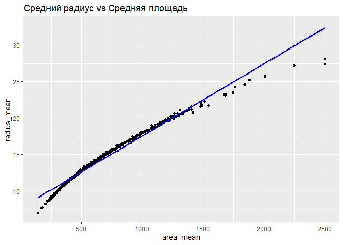

DZ5_SmetaninaDY
================
2024-04-09

# Домашнее задание 5

**Тема**: построение регрессионных моделей и анализ выживаемости.

**Цель**: научиться пользоваться основными методами регрессионного
анализа, разобраться с принципами анализа выживаемости.

Описание ДЗ

Для выполнения первых двух заданий загрузите датасет Breast Cancer
Wisconsin.

В колонке diagnosis содержится информация об опухоли (M =
злокачественная, B = доброкачественная).

Выполните перечисленные задания.

## **Задание 1 (2 балла)**

Создайте регрессионную модель, которая бы описывала связь среднего
радиуса опухоли и средней площади (а), среднего периметра (б), средней
симметричности (в).

Постройте графики, на которых отразите регрессионную прямую, и
прокомментируйте свои находки.

``` r
library(ggplot2)

# Загрузка данных
data <- read.csv("c:/dataset/wisconsin_breast_cancer.csv")

str(data)
```

    ## 'data.frame':    569 obs. of  33 variables:
    ##  $ id                     : int  842302 842517 84300903 84348301 84358402 843786 844359 84458202 844981 84501001 ...
    ##  $ diagnosis              : chr  "M" "M" "M" "M" ...
    ##  $ radius_mean            : num  18 20.6 19.7 11.4 20.3 ...
    ##  $ texture_mean           : num  10.4 17.8 21.2 20.4 14.3 ...
    ##  $ perimeter_mean         : num  122.8 132.9 130 77.6 135.1 ...
    ##  $ area_mean              : num  1001 1326 1203 386 1297 ...
    ##  $ smoothness_mean        : num  0.1184 0.0847 0.1096 0.1425 0.1003 ...
    ##  $ compactness_mean       : num  0.2776 0.0786 0.1599 0.2839 0.1328 ...
    ##  $ concavity_mean         : num  0.3001 0.0869 0.1974 0.2414 0.198 ...
    ##  $ concave.points_mean    : num  0.1471 0.0702 0.1279 0.1052 0.1043 ...
    ##  $ symmetry_mean          : num  0.242 0.181 0.207 0.26 0.181 ...
    ##  $ fractal_dimension_mean : num  0.0787 0.0567 0.06 0.0974 0.0588 ...
    ##  $ radius_se              : num  1.095 0.543 0.746 0.496 0.757 ...
    ##  $ texture_se             : num  0.905 0.734 0.787 1.156 0.781 ...
    ##  $ perimeter_se           : num  8.59 3.4 4.58 3.44 5.44 ...
    ##  $ area_se                : num  153.4 74.1 94 27.2 94.4 ...
    ##  $ smoothness_se          : num  0.0064 0.00522 0.00615 0.00911 0.01149 ...
    ##  $ compactness_se         : num  0.049 0.0131 0.0401 0.0746 0.0246 ...
    ##  $ concavity_se           : num  0.0537 0.0186 0.0383 0.0566 0.0569 ...
    ##  $ concave.points_se      : num  0.0159 0.0134 0.0206 0.0187 0.0188 ...
    ##  $ symmetry_se            : num  0.03 0.0139 0.0225 0.0596 0.0176 ...
    ##  $ fractal_dimension_se   : num  0.00619 0.00353 0.00457 0.00921 0.00511 ...
    ##  $ radius_worst           : num  25.4 25 23.6 14.9 22.5 ...
    ##  $ texture_worst          : num  17.3 23.4 25.5 26.5 16.7 ...
    ##  $ perimeter_worst        : num  184.6 158.8 152.5 98.9 152.2 ...
    ##  $ area_worst             : num  2019 1956 1709 568 1575 ...
    ##  $ smoothness_worst       : num  0.162 0.124 0.144 0.21 0.137 ...
    ##  $ compactness_worst      : num  0.666 0.187 0.424 0.866 0.205 ...
    ##  $ concavity_worst        : num  0.712 0.242 0.45 0.687 0.4 ...
    ##  $ concave.points_worst   : num  0.265 0.186 0.243 0.258 0.163 ...
    ##  $ symmetry_worst         : num  0.46 0.275 0.361 0.664 0.236 ...
    ##  $ fractal_dimension_worst: num  0.1189 0.089 0.0876 0.173 0.0768 ...
    ##  $ X                      : logi  NA NA NA NA NA NA ...

``` r
# а) Создание модели линейной регрессии для среднего радиуса и средней площади
model_area <- lm(radius_mean ~ area_mean, data = data)

# б) Создание модели линейной регрессии для среднего радиуса и среднего периметра
model_perimeter <- lm(radius_mean ~ perimeter_mean, data = data)

# в) Создание модели линейной регрессии для среднего радиуса и средней симметрии
model_symmetry <- lm(radius_mean ~ symmetry_mean, data = data)
```

``` r
# а) Визуализация для модели среднего радиуса и средней площади
ggplot(data, aes(x = area_mean, y = radius_mean)) +
  geom_point() +
  geom_smooth(method = "lm", col = "blue") +
  ggtitle("Средний радиус vs Средняя площадь")
```

    ## `geom_smooth()` using formula = 'y ~ x'

<!-- -->

``` r
# б) Визуализация для модели среднего радиуса и среднего периметра
ggplot(data, aes(x = perimeter_mean, y = radius_mean)) +
  geom_point() +
  geom_smooth(method = "lm", col = "red") +
  ggtitle("Средний радиус vs Средний периметр")
```

    ## `geom_smooth()` using formula = 'y ~ x'

<!-- -->

``` r
# в) Визуализация для модели среднего радиуса и средней симметрии
ggplot(data, aes(x = symmetry_mean, y = radius_mean)) +
  geom_point() +
  geom_smooth(method = "lm", col = "green") +
  ggtitle("Средний радиус vs Средняя симметрия")
```

    ## `geom_smooth()` using formula = 'y ~ x'

<!-- -->

На полученных графиках изображены регрессионные прямые для трёх моделей,
где средний радиус опухоли (radius_mean) предсказывается на основе
средней площади (area_mean), среднего периметра (perimeter_mean) и
средней симметрии (symmetry_mean).

Комментируя находки:

- а) Средний радиус и средняя площадь (синяя линия):

Модель показывает очень сильную линейную зависимость. Это ожидаемо, так
как площадь прямо пропорциональна квадрату радиуса в геометрии. Данные
плотно сгруппированы вокруг линии регрессии, что указывает на высокую
степень точности модели.

- б) Средний радиус и средний периметр (красная линия):

Связь также очень сильная и чёткая, что согласуется с математическими
ожиданиями, так как периметр и радиус связаны линейной функцией в случае
окружности. Регрессионная линия тесно следует за наблюдаемыми
значениями.

- в) Средний радиус и средняя симметрия (зелёная линия):

Зависимость между средним радиусом и симметрией значительно слабее, что
отражено в более широком разбросе точек вокруг регрессионной линии. Это
говорит о том, что симметрия опухоли не имеет такой же прямой и сильной
связи с размером опухоли, как площадь или периметр.

Визуализация помогает наглядно оценить качество построенных моделей и их
адекватность в отношении описания взаимосвязи между переменными. Для
средней площади и среднего периметра регрессионная прямая подходит очень
хорошо, тогда как для средней симметрии — в меньшей степени. Это
указывает на различную природу этих характеристик и их вклад в
определение размера опухоли.

``` r
# Вывод краткого описания моделей
# а)
summary(model_area)
```

    ## 
    ## Call:
    ## lm(formula = radius_mean ~ area_mean, data = data)
    ## 
    ## Residuals:
    ##     Min      1Q  Median      3Q     Max 
    ## -4.9604 -0.1801  0.1479  0.3600  0.7788 
    ## 
    ## Coefficients:
    ##              Estimate Std. Error t value Pr(>|t|)    
    ## (Intercept) 7.652e+00  4.955e-02   154.4   <2e-16 ***
    ## area_mean   9.887e-03  6.666e-05   148.3   <2e-16 ***
    ## ---
    ## Signif. codes:  0 '***' 0.001 '**' 0.01 '*' 0.05 '.' 0.1 ' ' 1
    ## 
    ## Residual standard error: 0.5591 on 567 degrees of freedom
    ## Multiple R-squared:  0.9749, Adjusted R-squared:  0.9748 
    ## F-statistic: 2.2e+04 on 1 and 567 DF,  p-value: < 2.2e-16

``` r
# б)
summary(model_perimeter)
```

    ## 
    ## Call:
    ## lm(formula = radius_mean ~ perimeter_mean, data = data)
    ## 
    ## Residuals:
    ##      Min       1Q   Median       3Q      Max 
    ## -1.43367 -0.10445  0.02596  0.14652  0.60550 
    ## 
    ## Coefficients:
    ##                 Estimate Std. Error t value Pr(>|t|)    
    ## (Intercept)    0.8177520  0.0379227   21.56   <2e-16 ***
    ## perimeter_mean 0.1447176  0.0003987  362.99   <2e-16 ***
    ## ---
    ## Signif. codes:  0 '***' 0.001 '**' 0.01 '*' 0.05 '.' 0.1 ' ' 1
    ## 
    ## Residual standard error: 0.2309 on 567 degrees of freedom
    ## Multiple R-squared:  0.9957, Adjusted R-squared:  0.9957 
    ## F-statistic: 1.318e+05 on 1 and 567 DF,  p-value: < 2.2e-16

``` r
# в)
summary(model_symmetry)
```

    ## 
    ## Call:
    ## lm(formula = radius_mean ~ symmetry_mean, data = data)
    ## 
    ## Residuals:
    ##     Min      1Q  Median      3Q     Max 
    ## -7.3711 -2.4426 -0.5862  1.5744 14.2934 
    ## 
    ## Coefficients:
    ##               Estimate Std. Error t value Pr(>|t|)    
    ## (Intercept)    10.6867     0.9783  10.924  < 2e-16 ***
    ## symmetry_mean  18.9918     5.3393   3.557 0.000406 ***
    ## ---
    ## Signif. codes:  0 '***' 0.001 '**' 0.01 '*' 0.05 '.' 0.1 ' ' 1
    ## 
    ## Residual standard error: 3.488 on 567 degrees of freedom
    ## Multiple R-squared:  0.02183,    Adjusted R-squared:  0.0201 
    ## F-statistic: 12.65 on 1 and 567 DF,  p-value: 0.0004065

Результат анализа линейной регрессионной модели, где средний радиус
опухоли (radius_mean) предсказывается на основе её средней площади
(area_mean):

- Intercept (Перехват): Оценка коэффициента для перехвата составляет
  примерно 7.652. Это означает, что если средняя площадь опухоли равна 0
  (что практически невозможно), ожидаемый средний радиус будет равен
  7.652. Перехват может интерпретироваться только в контексте
  математической модели, так как средняя площадь не может быть нулевой.

- Coefficients (Коэффициенты): Коэффициент для area_mean равен 0.009887.
  Это говорит о том, что с каждым увеличением средней площади на одну
  единицу, средний радиус увеличивается на 0.009887 единиц. Это
  положительное значение указывает на прямую связь между площадью и
  радиусом опухоли.

- Std. Error (Стандартная ошибка): Стандартные ошибки для перехвата и
  area_mean составляют 0.04955 и 0.00006666 соответственно, что
  указывает на высокую точность этих оценок.

- t value (t-значение): Очень высокие значения t-значений для обоих
  коэффициентов (154.4 для перехвата и 148.3 для area_mean) указывают на
  их статистическую значимость, что подтверждается очень малыми
  p-значениями.

- Pr(\>\|t\|) (P-value, p-значение): p-значения для обоих коэффициентов
  меньше 2e-16, что говорит о чрезвычайно низкой вероятности того, что
  такие или более значительные результаты могли бы быть получены
  случайно, если бы на самом деле никакой зависимости не существовало.

- Residual Standard Error (Стандартная ошибка остатков):
  Среднеквадратичное отклонение остатков модели составляет 0.5591, что
  показывает среднее отклонение наблюдаемых значений от предсказанных
  моделью.

- Multiple R-squared (Коэффициент детерминации ): Значение в 0.9749
  свидетельствует о том, что около 97.49% вариации среднего радиуса
  может быть объяснено изменениями в средней площади. Это указывает на
  очень сильную связь между этими переменными.

- Adjusted R-squared (Скорректированный ): С аналогичным значением
  0.9748, это показывает, что модель очень хорошо адаптирована к данным,
  даже после корректировки на количество переменных в модели.

- F-statistic (F-статистика): Очень высокое значение F-статистики
  (2.2e+04) с p-значением меньше 2.2e-16 подтверждает, что модель в
  целом статистически значима.

Эти результаты подчёркивают, что существует сильная и значимая линейная
зависимость между средним радиусом и средней площадью опухоли, с высокой
степенью точности предсказаний модели.

Результат анализа линейной регрессионной модели, в которой средний
радиус опухоли (radius_mean) предсказывается на основе её среднего
периметра (perimeter_mean):

- Intercept (Перехват): Значение перехвата примерно 0.818, что говорит о
  том, что при среднем периметре равном 0, ожидаемый средний радиус
  будет равен 0.818. Эта величина не имеет прямого физического смысла,
  поскольку средний периметр не может быть нулевым, но важна для
  математической модели.

- Coefficients (Коэффициенты): Коэффициент для perimeter_mean составляет
  примерно 0.1447. Это указывает на то, что с увеличением среднего
  периметра на одну единицу, средний радиус увеличивается на 0.1447
  единиц. Это подтверждает сильную положительную корреляцию между
  средним периметром и средним радиусом опухоли.

- Std. Error (Стандартная ошибка): Стандартные ошибки для перехвата и
  perimeter_mean довольно малы, что свидетельствует о высокой точности
  этих оценок.

- t value (t-значение): Очень высокие t-значения для обоих коэффициентов
  подтверждают их статистическую значимость. Значение t для
  perimeter_mean особенно высоко, что указывает на чрезвычайно сильную
  зависимость между средним периметром и средним радиусом.

- Pr(\>\|t\|) (P-value, p-значение): P-значения для обоих коэффициентов
  меньше 2e-16, подтверждая их статистическую значимость с очень высокой
  степенью уверенности.

- Residual Standard Error (Стандартная ошибка остатков): Среднее
  отклонение наблюдаемых значений от предсказанных моделью значений
  составляет 0.2309, что указывает на высокую точность предсказаний
  модели.

- Multiple R-squared (Коэффициент детерминации ): Значение 0.9957
  свидетельствует о том, что около 99.57% изменчивости среднего радиуса
  может быть объяснено через изменения в среднем периметре. Это
  указывает на чрезвычайно сильную связь между этими переменными.

- Adjusted R-squared (Скорректированный ): Подтверждает высокую
  адекватность модели, показывая, что добавление дополнительных
  переменных не улучшит модель значимо.

- F-statistic (F-статистика): Очень высокое значение F-статистики в
  сочетании с низким p-значением подтверждает, что модель значимо лучше,
  чем базовая модель без предикторов.

Эти результаты ясно указывают на то, что существует сильная и значимая
линейная зависимость между средним периметром и средним радиусом
опухоли,

Результат анализа линейной регрессионной модели, предсказывающей средний
радиус опухоли (radius_mean) на основе средней симметрии
(symmetry_mean):

- Intercept (Перехват): Значение перехвата около 10.687 указывает на
  ожидаемый средний радиус, если бы средняя симметрия была равна 0. Это
  значение не имеет практического физического смысла, поскольку
  симметрия не может быть нулевой, но служит важным компонентом
  регрессионной модели.

- Coefficients (Коэффициенты): Коэффициент для средней симметрии
  составляет примерно 18.992. Это означает, что с каждым увеличением
  средней симметрии на одну единицу, средний радиус увеличивается на
  18.992. Такое значительное увеличение указывает на положительную
  корреляцию между симметрией и радиусом опухоли, хотя связь кажется не
  очень сильной из-за низкого коэффициента детерминации.

- Std. Error (Стандартная ошибка): Стандартные ошибки для перехвата и
  symmetry_mean достаточно высоки, особенно для коэффициента симметрии,
  что отражает некоторую неопределенность в оценке его влияния.

- t value (t-значение): Высокие t-значения для обоих коэффициентов
  говорят о их статистической значимости, хотя значение для симметрии
  меньше, чем для перехвата, что отражает меньшую степень уверенности в
  влиянии симметрии на радиус.

- Pr(\>\|t\|) (P-value, p-значение): Маленькие p-значения для обоих
  коэффициентов подтверждают их статистическую значимость, хотя значение
  p для симметрии (0.000406) выше, чем для перехвата, что указывает на
  большую вероятность случайного получения таких результатов по
  сравнению с перехватом.

- Residual Standard Error (Стандартная ошибка остатков): Значение 3.488
  указывает на относительно большой разброс наблюдаемых значений радиуса
  вокруг значений, предсказанных моделью. Это свидетельствует о том, что
  модель не очень точно описывает данные.

- Multiple R-squared (Коэффициент детерминации ): Значение 0.02183
  говорит о том, что только около 2.18% изменчивости среднего радиуса
  может быть объяснено с помощью средней симметрии. Это указывает на
  очень слабую зависимость между этими переменными.

- Adjusted R-squared (Скорректированный ): Скорректированный коэффициент
  детерминации немного ниже и составляет 0.0201, что подтверждает, что
  добавление переменной симметрии в модель не вносит значительного
  улучшения в объяснение вариативности радиуса.

- F-statistic (F-статистика): Значение F-статистики 12.65 с p-значением
  0.0004065 подтверждает, что модель статистически значима, но в целом
  её способность объяснять изменчивость радиуса опухоли ограничена.

Эти результаты показывают, что, хотя существует статистически значимая
связь между средней симметрией и средним радиусом опухоли, эта связь не
является сильной. Большая часть изменчивости среднего радиуса не
объясняется средней симметрией, что указывает на необходимость
рассмотрения других переменных для более точного предсказания.

## Задание 2 (2 балла)

Пусть колонка с диагнозом принимает следующие значения: злокачественная
опухоль — 1, а доброкачественная — 0. Постройте модель, которая бы
прогнозировала вероятность возникновения злокачественной опухоли от
среднего радиуса (а), средней площади (б), средней текстуры (в).

Постройте графики. Создайте модель, которая бы прогнозировала
вероятность возникновения злокачественной опухоли от всех трех
перечисленных факторов.

Для выполнения этого задания можно использовать логистическую регрессию,
так как она подходит для прогнозирования вероятности принадлежности к
определённой категории (в данном случае, категории злокачественных
опухолей). Переменная diagnosis будет зависимой переменной, которую
преобразуем так, чтобы злокачественные опухоли соответствовали 1, а
доброкачественные — 0. Независимыми переменными будут средний радиус
(radius_mean), средняя площадь (area_mean), и средняя текстура
(texture_mean).  

``` r
# Преобразование переменной diagnosis в числовой формат
data$diagnosis <- ifelse(data$diagnosis == "M", 1, 0)
```

``` r
# Создание модели логистической регрессии
model <- glm(diagnosis ~ radius_mean + area_mean + texture_mean, data = data, family = binomial())

# Вывод краткого описания модели
summary(model)
```

    ## 
    ## Call:
    ## glm(formula = diagnosis ~ radius_mean + area_mean + texture_mean, 
    ##     family = binomial(), data = data)
    ## 
    ## Coefficients:
    ##              Estimate Std. Error z value Pr(>|z|)    
    ## (Intercept)  -9.48796    6.88503  -1.378    0.168    
    ## radius_mean  -0.38523    0.95524  -0.403    0.687    
    ## area_mean     0.01636    0.01100   1.487    0.137    
    ## texture_mean  0.20917    0.03714   5.632 1.78e-08 ***
    ## ---
    ## Signif. codes:  0 '***' 0.001 '**' 0.01 '*' 0.05 '.' 0.1 ' ' 1
    ## 
    ## (Dispersion parameter for binomial family taken to be 1)
    ## 
    ##     Null deviance: 751.44  on 568  degrees of freedom
    ## Residual deviance: 288.81  on 565  degrees of freedom
    ## AIC: 296.81
    ## 
    ## Number of Fisher Scoring iterations: 7

``` r
# Создание прогнозов на основе модели для каждого наблюдения
data$predicted_prob <- predict(model, type = "response")
```

``` r
# Визуализация прогнозируемой вероятности злокачественной опухоли от средней радиуса
ggplot(data, aes(x = radius_mean, y = predicted_prob, colour = factor(diagnosis))) +
  geom_point() +
  labs(title = "Прогноз вероятности злокачественной опухоли от среднего радиуса",
       x = "Средний радиус",
       y = "Прогнозируемая вероятность") +
  scale_colour_manual(values = c("0" = "blue", "1" = "red"), labels = c("0" = "Доброкачественная", "1" = "Злокачественная")) +
  theme_minimal()
```

<!-- -->

``` r
# Визуализация прогнозируемой вероятности злокачественной опухоли от средней площади
ggplot(data, aes(x = area_mean, y = predicted_prob, colour = factor(diagnosis))) +
  geom_point() +
  labs(title = "Прогноз вероятности злокачественной опухоли от средней площади",
       x = "Средняя площадь",
       y = "Прогнозируемая вероятность") +
  scale_colour_manual(values = c("0" = "blue", "1" = "red"), labels = c("0" = "Доброкачественная", "1" = "Злокачественная")) +
  theme_minimal()
```

<!-- -->

``` r
# Визуализация прогнозируемой вероятности злокачественной опухоли от средней текстуры
ggplot(data, aes(x = texture_mean, y = predicted_prob, colour = factor(diagnosis))) +
  geom_point() +
  labs(title = "Прогноз вероятности злокачественной опухоли от средней текстуры",
       x = "Средняя текстура",
       y = "Прогнозируемая вероятность") +
  scale_colour_manual(values = c("0" = "blue", "1" = "red"), labels = c("0" = "Доброкачественная", "1" = "Злокачественная")) +
  theme_minimal()
```

<!-- -->

На полученных графиках отображены прогнозы вероятности злокачественной
опухоли (где злокачественные опухоли обозначены как 1, а
доброкачественные — как 0), сделанные с помощью логистической регрессии,
в зависимости от трех различных предикторов: среднего радиуса, средней
площади и средней текстуры.

- Прогноз вероятности злокачественной опухоли от среднего радиуса:

График показывает, что по мере увеличения среднего радиуса, вероятность
того, что опухоль окажется злокачественной, возрастает. Точки,
обозначающие злокачественные опухоли, группируются ближе к верхней
границе графика, особенно при больших значениях радиуса. Для
доброкачественных опухолей видно, что вероятности ближе к нижней
границе, особенно при меньших значениях радиуса. Прогноз вероятности
злокачественной опухоли от средней площади:

- Аналогично, увеличение средней площади сопровождается увеличением
  вероятности злокачественной опухоли. На графике заметно, что при
  большой площади почти все опухоли злокачественные.

- Прогноз вероятности злокачественной опухоли от средней текстуры:

Взаимосвязь между средней текстурой и вероятностью злокачественности не
так явно выражена, как в предыдущих случаях. Однако, можно заметить, что
с увеличением текстуры увеличивается разброс точек, и при более высоких
значениях текстуры присутствует больше злокачественных опухолей. Общие
наблюдения:

Все три предиктора показывают, что большие значения радиуса, площади и
текстуры ассоциируются с более высокой вероятностью злокачественной
опухоли.

Отношения кажутся более выраженными для радиуса и площади, чем для
текстуры.

На графиках видно, что модель логистической регрессии может достаточно
хорошо различать между доброкачественными и злокачественными опухолями
на основе данных предикторов.

## Задание 3 (6 балла)

Для выполнения этого задания вам понадобится датасет lung, который
встроен в пакет survival. Установите этот пакет и загрузите датасет.

Датасет содержит следующий набор переменных:

- inst: код учреждения;

- time: время выживаемости в днях;

- status: 1 = цензурирование, 2 = смерть;

- age: возраст в годах;

- sex: мужской = 1, женский = 2;

- ph.ecog: шкала опросника ECOG (оценку проводит врач). 0 = отсутствие
  симптомов, 1= симптомы есть, но пациент наблюдается амбулаторно, 2 =
  меньше половины дня пациент вынужден проводить в постели, 3 = больше
  половины дня нуждается в отдыхе лежа, но не прикован к постели, 4 =
  прикован к постели;

- ph.karno: шкала Карновского (от 0 до 100, от худшего к лучшему) по
  оценке врача;

- pat.karno: шкала Карновского (от 0 до 100, от худшего к лучшему) по
  оценке пациента;

- meal.cal: калории потребляемой пищи;

- wt.loss: потеря веса за последние полгода.

Создайте переменную event, в которой отразите наличие или отсутствие (1
или 0) интересующего события — смерти пациента.

Изучите работу функций Surv(), survfit() и ggsurvplot():

Постройте кривые выживаемости в зависимости от пола (на одном графике
должны получиться две кривые для каждого пола и таблица числа пациентов,
подверженных риску (at risk) под ним). Поясните получившееся значение
p-value для лог-рангового теста и опишите наблюдаемые результаты.

Постройте график кумулятивной функции рисков (cumulative hazard
function) для пола. Проинтерпретируйте график. С помощью функции coxph()
постройте регрессию Кокса и оцените влияние пола на выживаемость. Что вы
можете сказать о полученных результатах?

``` r
# Установка и загрузка пакета survival
# install.packages("survival")
library(survival)
```

``` r
# Загрузка датасета lung :
# загружаем датасет
data("lung", package = "survival")
```

    ## Warning in data("lung", package = "survival"): данные 'lung' не найдены

``` r
# Проверим, загрузились ли данные
head(lung)
```

    ##   inst time status age sex ph.ecog ph.karno pat.karno meal.cal wt.loss
    ## 1    3  306      2  74   1       1       90       100     1175      NA
    ## 2    3  455      2  68   1       0       90        90     1225      15
    ## 3    3 1010      1  56   1       0       90        90       NA      15
    ## 4    5  210      2  57   1       1       90        60     1150      11
    ## 5    1  883      2  60   1       0      100        90       NA       0
    ## 6   12 1022      1  74   1       1       50        80      513       0

``` r
# Создаем переменную event, в которой отражено наличие или отсутствие (1 или 0) интересующего события — смерти пациента.
lung$event <- ifelse(lung$status == 2, 1, 0) # 1 для смерти, 0 для цензурирования
```

``` r
str(lung)
```

    ## 'data.frame':    228 obs. of  11 variables:
    ##  $ inst     : num  3 3 3 5 1 12 7 11 1 7 ...
    ##  $ time     : num  306 455 1010 210 883 ...
    ##  $ status   : num  2 2 1 2 2 1 2 2 2 2 ...
    ##  $ age      : num  74 68 56 57 60 74 68 71 53 61 ...
    ##  $ sex      : num  1 1 1 1 1 1 2 2 1 1 ...
    ##  $ ph.ecog  : num  1 0 0 1 0 1 2 2 1 2 ...
    ##  $ ph.karno : num  90 90 90 90 100 50 70 60 70 70 ...
    ##  $ pat.karno: num  100 90 90 60 90 80 60 80 80 70 ...
    ##  $ meal.cal : num  1175 1225 NA 1150 NA ...
    ##  $ wt.loss  : num  NA 15 15 11 0 0 10 1 16 34 ...
    ##  $ event    : num  1 1 0 1 1 0 1 1 1 1 ...

``` r
# Загрузка дополнительного пакета для визуализации
# install.packages("survminer")
library(survminer)
```

    ## Загрузка требуемого пакета: ggpubr

    ## 
    ## Присоединяю пакет: 'survminer'

    ## Следующий объект скрыт от 'package:survival':
    ## 
    ##     myeloma

``` r
# Построение кривых выживаемости с помощью Surv(), survfit():
# Определение объекта выживаемости
surv_obj <- Surv(time = lung$time, event = lung$event)

# Построение модели выживаемости
fit <- survfit(surv_obj ~ sex, data = lung)

# Визуализация кривых выживаемости
ggsurvplot(fit, data = lung, pval = TRUE, risk.table = TRUE,
           ggtheme = theme_minimal(),
           palette = c("blue", "red"),
           xlab = "Время (дни)",
           ylab = "Вероятность выживаемости",
           title = "Кривые выживаемости по полу")
```

<!-- -->

На полученном графике изображены кривые выживаемости по полу,
построенные с помощью анализа Каплана-Мейера. График показывает две
кривые: одна для мужчин (sex=1, синий цвет), другая для женщин (sex=2,
красный цвет). Под графиком находится таблица с числом пациентов,
подверженных риску (number at risk), которая показывает, сколько
пациентов оставалось в каждой группе в каждый момент времени.

Основные наблюдения по графику:

- Кривая выживаемости для женщин находится выше кривой выживаемости для
  мужчин, что указывает на более высокую вероятность выживаемости у
  женщин в данном наборе данных.

- Со временем количество пациентов, подверженных риску, снижается, что
  свидетельствует о смертях или цензурировании случаев (например,
  окончание периода наблюдения).

P-value для лог-рангового теста на графике равно 0.0013, что говорит о
том, что различия между кривыми выживаемости мужчин и женщин
статистически значимы. Лог-ранговый тест сравнивает две кривые
выживаемости и проверяет нулевую гипотезу о том, что нет различий в
выживаемости между группами. Значение p меньше стандартного порога в
0.05 позволяет отвергнуть нулевую гипотезу и сделать вывод о том, что
пол имеет статистически значимое влияние на выживаемость пациентов в
данной выборке.

Таким образом, по результатам анализа можно предположить, что женщины с
раком легких имеют более высокие шансы на выживание по сравнению с
мужчинами. Однако следует учитывать, что это наблюдение может быть
связано с множеством факторов, включая стадию заболевания, лечение,
возраст и другие переменные, не учтенные в данном анализе.

``` r
# Построение модели выживаемости с разделением по полу
fit_sex <- survfit(surv_obj ~ sex, data = lung)

# Визуализация кумулятивной функции рисков для разных полов
ggsurvplot(fit_sex, data = lung, fun = "cumhaz", risk.table = TRUE,
           ggtheme = theme_minimal(),
           palette = c("blue", "red"),
           xlab = "Время (дни)",
           ylab = "Кумулятивная функция рисков",
           title = "Кумулятивная функция рисков по полу")
```

<!-- -->

На полученном графике изображены кумулятивные функции рисков для двух
групп: мужчин (синий цвет) и женщин (красный цвет), основанные на данных
датасета lung. Каждая кривая отражает накопление риска события (в данном
случае смерти от рака легких) с течением времени для каждого пола.

Интерпретация:

- Кривые показывают, что риск смерти с течением времени увеличивается
  для обеих групп. Это стандартное поведение кумулятивной функции рисков
  в анализе выживаемости.

- Кривая для мужчин поднимается быстрее и достигает более высоких
  значений по сравнению с кривой для женщин. Это может указывать на
  более высокий общий риск смерти от рака легких среди мужчин в данной
  выборке.

- Поле “Number at risk” под графиком отображает количество пациентов,
  которые еще не испытали событие и продолжают участвовать в
  исследовании на каждый момент времени. Это число уменьшается по мере
  того, как пациенты умирают или их данные цензурируются.

- Кумулятивная функция рисков предоставляет полезную информацию для
  оценки и сравнения скорости накопления риска между группами.

На основе этого графика можно заключить, что пол пациентов может играть
роль в риске смерти от рака легких, с более высоким риском для мужчин в
данной клинической группе.

``` r
# Построение регрессии Кокса с помощью coxph():
# Построение регрессии Кокса для оценки влияния пола на выживаемость
cox_model <- coxph(surv_obj ~ sex, data = lung)

# Вывод результатов регрессии Кокса
summary(cox_model)
```

    ## Call:
    ## coxph(formula = surv_obj ~ sex, data = lung)
    ## 
    ##   n= 228, number of events= 165 
    ## 
    ##        coef exp(coef) se(coef)      z Pr(>|z|)   
    ## sex -0.5310    0.5880   0.1672 -3.176  0.00149 **
    ## ---
    ## Signif. codes:  0 '***' 0.001 '**' 0.01 '*' 0.05 '.' 0.1 ' ' 1
    ## 
    ##     exp(coef) exp(-coef) lower .95 upper .95
    ## sex     0.588      1.701    0.4237     0.816
    ## 
    ## Concordance= 0.579  (se = 0.021 )
    ## Likelihood ratio test= 10.63  on 1 df,   p=0.001
    ## Wald test            = 10.09  on 1 df,   p=0.001
    ## Score (logrank) test = 10.33  on 1 df,   p=0.001

Результаты регрессии Кокса показывают следующее:

Коэффициент для переменной sex равен -0.5310, что означает, что риск
смерти для одной группы на 53.10% ниже по сравнению с другой. Знак минус
указывает на то, что риск смерти уменьшается для группы с более высоким
кодом в переменной sex. Поскольку в описании датасета мужчины
кодировались как 1, а женщины — как 2, этот результат может означать,
что риск смерти для женщин ниже, чем для мужчин.

Отношение рисков (exp(coef)) равно 0.588, что подтверждает, что риск
события (смерти) для женщин примерно на 41.2% меньше, чем для мужчин,
если рассматривать только пол как фактор.

P-значение коэффициента для пола равно 0.00149, что значительно меньше
стандартного уровня значимости 0.05. Это указывает на статистически
значимую связь между полом пациента и выживаемостью при раке легких.

Доверительный интервал для отношения рисков (lower .95 и upper .95) не
включает 1 (от 0.4237 до 0.816), что подтверждает статистическую
значимость коэффициента.

Значение конкорданса (Concordance) равно 0.579, что указывает на то, что
модель имеет умеренную способность к прогнозированию. Конкорданс
показывает, насколько хорошо модель различает между событиями и
несобытиями.

Likelihood ratio test, Wald test и Score test показывают p-значения на
уровне 0.001 или ниже, что также свидетельствует о значимости пола в
модели.

Итак, эти результаты указывают на то, что пол является значимым
предиктором выживаемости пациентов с раком легких, с более низким риском
смерти для женщин по сравнению с мужчинами в данном датасете.
